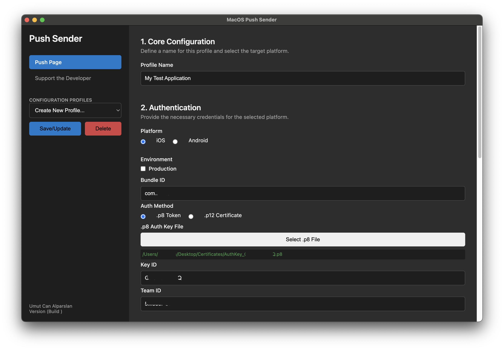
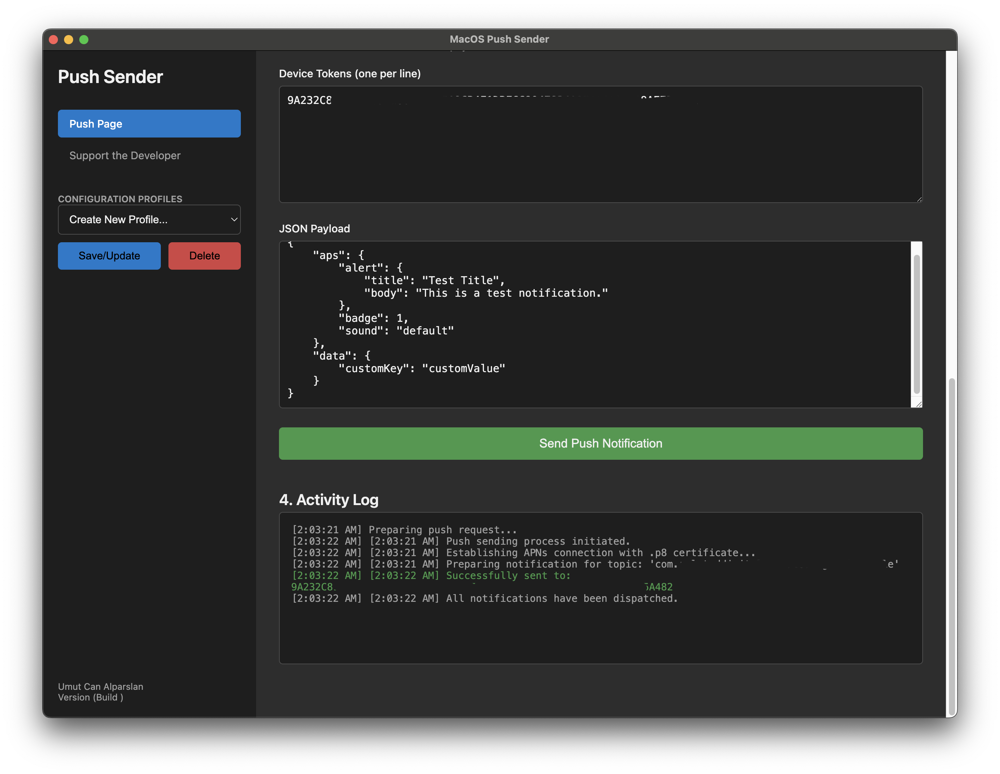

# MacOS Push Sender


A simple, powerful, and elegant desktop application for macOS to send push notifications to iOS (APNs) and Android (FCM) devices.




## Overview

This tool is designed for mobile developers and Q&A teams who need a straightforward way to test push notifications without complex server-side setups. It provides a clean user interface to manage configurations for multiple apps and send notifications quickly.

## ✨ Features

* **Cross-Platform Sending**: Send notifications to both iOS (APNs) and Android (FCM) platforms.
* **Flexible iOS Authentication**: Supports both modern `.p8` token-based authentication and legacy `.p12` certificate-based authentication.
* **Profile Management**: Save, load, and manage different configurations for all your apps. No need to re-enter credentials every time.
* **Payload & Token Persistence**: Saves your last used device tokens and JSON payload within each profile for maximum efficiency.
* **Bulk Sending**: Send a push notification to multiple devices at once by simply pasting a list of tokens.
* **Live Activity Log**: See the real-time status of your push notification dispatches, including success and failure reasons for each token.
* **Android Dry Run Mode**: Validate your FCM configuration and device tokens without actually sending a notification.
* **Built-in Support Page**: Access links to support the developer directly from the app.

## 🚀 Installation

The easiest way to get started is to download the latest official release.

1.  Go to the [**Releases**](https://github.com/umutalparslan/MacOSPushSender/releases) page of this repository.
2.  Download the latest `.dmg` file (e.g., `MacOS-Push-Sender-x.x.x.dmg`).
3.  Open the `.dmg` file and drag the **MacOS Push Sender** app into your Applications folder.

That's it! You can now launch the application from your Applications folder.

## 💻 Development

If you want to run the project locally or contribute, follow these steps:

1.  **Clone the repository:**
    ```bash
    git clone https://github.com/umutalparslan/MacOSPushSender.git
    cd MacOSPushSender
    ```

2.  **Install dependencies:**
    ```bash
    npm install
    ```

3.  **Run the app in development mode:**
    ```bash
    npm start
    ```

## 📄 License

This project is licensed under the MIT License. See the [LICENSE](LICENSE) file for details.

## ❤️ Support

If you find this application useful, please consider supporting its development through the links available in the **"Support the Developer"** section of the app. Every contribution is greatly appreciated!
